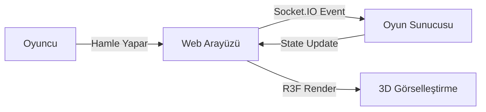

# 🚀 AstronGames

<div align="center">
  
</div>


**AstronGames**, modern web teknolojileri ve 3D grafiklerle güçlendirilmiş, gerçek zamanlı ve çok oyunculu bir oyun platformudur. Klasik masa oyunlarını (Okey 101, Tic-Tac-Toe, Tavla vb.) fütüristik bir atmosferde yeniden yorumlar.

> **Not:** Proje adı `AstronXoXGames` olarak başlamış olup, çoklu oyun yapısına evrildiği için **AstronGames** olarak yeniden markalanmıştır.

---

## 🌟 Öne Çıkan Özellikler

- **🌌 Etkileyici 3D Oyun Dünyası**: `React Three Fiber` ile geliştirilmiş, tamamen üç boyutlu ve interaktif oyun tahtaları.
- **⚡ Gerçek Zamanlı Çok Oyunculu**: `Socket.IO` altyapısı sayesinde gecikmesiz, anlık hamle senkronizasyonu.
- **🎨 Modern ve Şık Arayüz**: `Tailwind CSS` ve `Framer Motion` ile oluşturulmuş, akıcı animasyonlara sahip kullanıcı dostu arayüzler.
- **🧩 Çeşitli Oyun Modları**:
    - **Okey 101**: Gelişmiş taş dağıtma, ıstaka düzenleme ve oyun mantığı.
    - **XOX (Tic-Tac-Toe)**: Klasik oyunun modern, neon ışıklı yorumu.
    - **(Planlanan)**: Tavla, Satranç gibi diğer klasik oyunlar.

---

## 🛠 Teknolojik Altyapı

Bu proje, güncel ve performans odaklı teknolojiler kullanılarak geliştirilmiştir:

| Alan | Teknoloji | Açıklama |
|---|---|---|
| **Framework** |  | React framework'ü (v16.1.6) |
| **Dil** |  | Tip güvenli geliştirme |
| **3D Grafik** |  | `@react-three/fiber`, `@react-three/drei` |
| **Stil & Animasyon** |  | `framer-motion`, `clsx` |
| **State Yönetimi** |  | Basit ve hızlı durum yönetimi |
| **Real-time** |  | WebSocket tabanlı iletişim |

---

## 📂 Proje Yapısı

Proje, modüler ve ölçeklenebilir bir mimariye sahiptir:

```mermaid
graph TD
    src[src/] --> app[app/]
    src --> components[components/]
    src --> store[store/]
    src --> server[server/]
    
    app --> pages[Sayfalar ve Rotalar]
    app --> globals[Global Stiller]

    components --> game[game/ (Oyun Mantığı ve 3D)]
    components --> games[games/ (Oyun Seçimi)]
    components --> ui[ui/ (Ortak UI Bileşenleri)]

    store --> useOkeyStore[useOkeyStore (Okey Durumu)]
    store --> useGameStore[useGameStore (Genel Oyun Durumu)]
    
    server --> socket[Socket.IO Sunucusu]
```

### 📁 Temel Dizinler

- **`src/app`**: Next.js App Router yapısı. Sayfalar (`page.tsx`) ve layoutlar (`layout.tsx`) burada bulunur.
- **`src/components/game`**: Oyun içi bileşenler. `Board3D.tsx`, `Piece3D.tsx` gibi 3D nesneler ve `LobbyScreen.tsx` gibi arayüzler buradadır.
- **`src/store`**: `Zustand` ile oluşturulmuş global state yönetim dosyaları. Oyun mantığı (`useOkeyStore.ts`) burada merkezi olarak yönetilir.
- **`server/`**: Custom server yapılandırması, özellikle Socket.IO entegrasyonu için.

---

## 🚀 Kurulum ve Çalıştırma

Projeyi yerel ortamınızda çalıştırmak için aşağıdaki adımları izleyin:

1.  **Repo'yu Klonlayın:**
    ```bash
    git clone https://github.com/KULLANICI_ADI/astrongames.git
    cd astrongames
    ```

2.  **Bağımlılıkları Yükleyin:**
    ```bash
    npm install
    # veya
    yarn install
    ```

3.  **Geliştirme Sunucusunu Başlatın:**
    ```bash
    npm run dev
    ```

4.  **Tarayıcıda Açın:**
    `http://localhost:3000` adresine gidin.

---

## 📸 Oyun Görünümü (Konsept)

> *Not: Aşağıdaki görsel temsilidir.*



---

**AstronGames** ile oyunun geleceğine hoş geldiniz! 🚀
